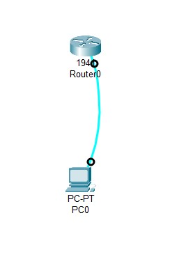
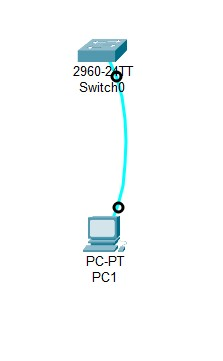

# <p align='center'> Initializing and Reloading a Router and Switch </p>

## Topology of Initializing and Reloading of -
<p align='center'>

| Router | Switch |
|--------|--------|
|  |  |

</p>

## Objectives 
- Part 1: Set Up Devices in the Network as Shown in the Topology 
- Part 2: Initialize the Router and Reload 
- Part 3: Initialize the Switch and Reload

## Background / Scenario
Before starting a CCNA hands-on lab that makes use of either a Cisco router or switch, ensure that the 
devices in use have been erased and have no startup configurations present. Otherwise, the results of your 
lab may be unpredictable. This lab provides a detail procedure for initializing and reloading a Cisco router and 
a Cisco switch. 

> [!NOTE]
>  The routers used with CCNA hands-on labs are Cisco 1941 Integrated Services Routers (ISRs) with 
Cisco IOS Release 15.2(4)M3 (universalk9 image). The switches used are Cisco Catalyst 2960s with Cisco 
IOS Release 15.0(2) (lanbasek9 image). Other routers, switches, and Cisco IOS versions can be used. 
Depending on the model and Cisco IOS version, the commands available and output produced might vary 
from what is shown in the labs. 

## Required Resources 
- 1 Router (Cisco 1941 with Cisco IOS software, Release 15.2(4)M3 universal image or comparable) 
- 1 Switch (Cisco 2960 with Cisco IOS Release 15.0(2) lanbasek9 image or comparable) 
- 2 PCs (Windows 7 or 8 with terminal emulation program, such as Tera Term) 
- Console cables to configure the Cisco IOS devices via the console ports 

## Part 1: Set Up Devices in the Network as Shown in the Topology 
1. Cable the network as shown in the topology. Attach console cables to the devices shown in the topology diagram. 
2. Power on all the devices in the topology. Wait for all devices to finish the software load process before moving to Part 2. 

## Part 2: Initialize the Router and Reload 
1. **Connect to the router.** <br>
   Console into the router and enter privileged EXEC mode using the enable command. 
   ```bash
   Router> enable 
   Router# 
   ```

2. **Erase the startup configuration file from NVRAM.** <br>
   Type the erase startup-config command to remove the startup configuration from nonvolatile random access memory (NVRAM). 
   ```bash
   Router# erase startup-config 
   Erasing the nvram filesystem will remove all configuration files! Continue? [confirm] 
   [OK] 
   Erase of nvram: complete 
   Router# 
   ```

3. **Reload the router.** <br> 
   Issue the reload command to remove an old configuration from memory. When prompted to Proceed with reload, press Enter to confirm the reload. Pressing any other key will abort the reload. 
   ```bash
   Router# reload 
   Proceed with reload? [confirm] 
   *Nov 29 18:28:09.923: %SYS-5-RELOAD: Reload requested by console. Reload Reason: Reload Command. 
   ```
   > [!NOTE]
   >  You may receive a prompt to save the running configuration prior to reloading the router. Respond by typing no and press Enter.

   ```bash
   System configuration has been modified. Save? [yes/no]: no 
   ```

4. **Bypass the initial configuration dialog.** <br> 
   After the router reloads, you are prompted to enter the initial configuration dialog. Enter no and press Enter. 
   ```bash
   Would you like to enter the initial configuration dialog? [yes/no]: no 
   ```

5. **Terminate the autoinstall program.** <br> 
   You will be prompted to terminate the autoinstall program. Respond yes and then press Enter. 
   ```bash
   Would you like to terminate autoinstall? [yes]: yes 
   Router> 
   ```

## Part 3: Initialize the Switch and Reload 
1. **Connect to the switch.** <br> 
   Console into the switch and enter privileged EXEC mode. 
   ```bash
   Switch> enable 
   Switch# 
   ```

2. **Determine if there have been any virtual local-area networks (VLANs) created.** <br>
   Use the show flash command to determine if any VLANs have been created on the switch. 
   ```bash
   Switch# show flash 
   ```

3. **Delete the VLAN file.** <br> 
   - If the vlan.dat file was found in flash, then delete this file. 
     ```bash
     Switch# delete vlan.dat 
     Delete filename [vlan.dat]? 
     ```
     You will be prompted to verify the file name. At this point, you can change the file name or just press Enter if you have entered the name correctly. 
   - When you are prompted to delete this file, press Enter to confirm the deletion. (Pressing any other key will abort the deletion.) 
     ```bash
     Delete flash:/vlan.dat? [confirm] 
     Switch# 
     ```

4. **Erase the startup configuration file.** <br> 
   Use the erase startup-config command to erase the startup configuration file from NVRAM. When you are prompted to remove the configuration file, press Enter to confirm the erase. (Pressing any other key will abort the operation.) 
   ```bash
   Switch# erase startup-config 
   Erasing the nvram filesystem will remove all configuration files! Continue? [confirm] 
   [OK] 
   Erase of nvram: complete 
   Switch# 
   ```

5. **Reload the switch.** <br> 
   Reload the switch to remove any old configuration information from memory. When you are prompted to reload the switch, press Enter to proceed with the reload. (Pressing any other key will abort the reload.) 
   ```bash
   Switch# reload 
   Proceed with reload? [confirm] 
   ```

   > [!NOTE]
   >  You may receive a prompt to save the running configuration prior to reloading the switch. Type no and press Enter. 

   ```bash
   System configuration has been modified. Save? [yes/no]: no 
   ```

6. **Bypass the initial configuration dialog.** <br> 
   After the switch reloads, you should see a prompt to enter the initial configuration dialog. Type no at the prompt and press Enter. 
   ```bash
   Would you like to enter the initial configuration dialog? [yes/no]: no 
   Switch>
   ```