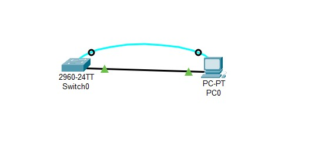
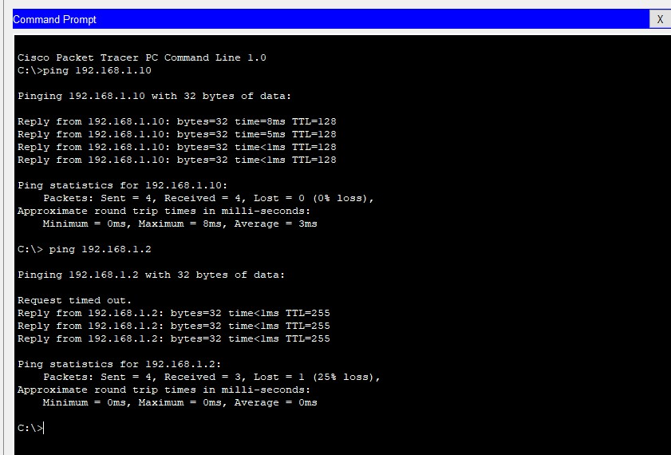

# <p align='center'> Configuring a Switch Management Address </p>
## Topology
<p align='center'>

| |
|-----|
|  |

</p>

## Addressing Table 
| Device | Interface | IP Address   | Subnet Mask   |
|--------|-----------|--------------|---------------|
| S1     | VLAN 1    | 192.168.1.2  | 255.255.255.0 |
| PC0    | NIC       | 192.168.1.10 | 255.255.255.0 |

## Objectives 
Part 1: Configure a Basic Network Device <br>
Part 2: Verify and Test Network Connectivity 

## Background / Scenario 
Cisco switches have a special interface, known as a switch virtual interface (SVI). The SVI can be configured 
with an IP address, commonly referred to as the management address. The management address is used for 
remote access to the switch to display or configure settings. 
In this lab, you will build a simple network using Ethernet LAN cabling and access a Cisco switch using the 
console and remote access methods. You will configure basic switch settings, IP addressing, and 
demonstrate the use of a management IP address for remote switch management. The topology consists of 
one switch and one host using only Ethernet and console ports. 

> [!NOTE]
>  The switches used are Cisco Catalyst 2960s with Cisco IOS Release 15.0(2) (lanbasek9 image). Other 
switches and Cisco IOS versions can be used. Depending on the model and Cisco IOS version, the available 
commands and output produced might vary from what is shown in the labs. 

> [!NOTE]
>  Make sure that the switch has been erased and has no startup configuration. If you are unsure, contact 
your instructor.

## Required Resources 
- 1 Switch (Cisco 2960 with Cisco IOS Release 15.0(2) lanbasek9 image or comparable) 
- 1 PC (Windows 7 or 8 with terminal emulation program, such as Tera Term) 
- Console cables to configure the Cisco IOS devices via the console ports 
- Ethernet cables as shown in the topology

## Procedures:

### Initializing and Reloading Switch
[Read only <Part 3: Initialize the Switch and Reload> and return here. ](/Initialize%20and%20Reload/README.md#Part-3-Initialize-the-Switch-and-Reload)

### Part 1: Configure a Basic Network Device 
In Part 1, you will set up the network and configure basic settings, such as hostnames, interface IP 
addresses, and passwords. <br>

1. **Cable the network.** <br> 
   - Cable the network as shown in the topology. 
   - Establish a console connection to the switch from PC-A. 

2. **Configure basic switch settings.** <br> 
In this step, you will configure basic switch settings, such as hostname, and configure an IP address for the SVI. Assigning an IP address on the switch is only the first step. As the network administrator, you must specify how the switch will be managed. Telnet and SSH are two of the most common management methods. However, Telnet is a very insecure protocol. All information flowing between the two devices is sent in 
plaintext. Passwords and other sensitive information can be easily viewed if captured by a packet sniffer. 

   - [Read only <Part4: Configure and Verify Basic Switch Settings from step 1 to step 7> and return here. ](/Lab01/README.md#Part4:-Configure-and-Verify-Basic-Switch-Settings)
   - Enter global configuration mode to set the SVI IP address to allow remote switch management.
   ```bash
   S1# config t 
   S1#(config)# interface vlan 1 
   S1(config-if)# ip address 192.168.1.2 255.255.255.0 
   S1(config-if)# no shut 
   S1(config-if)# exit 
   S1(config)# 
   ```

   - Configure the VTY line for the switch to allow Telnet access. If you do not configure a VTY password, you will not be able to telnet to the switch. 
   ```bash
   S1(config)# line vty 0 4 
   S1(config-line)# password cisco 
   S1(config-line)# login 
   S1(config-line)# end 
   S1# 
   *Mar  1 00:06:11.590: %SYS-5-CONFIG_I: Configured from console by console
   ```

   - **Save the configuration.** <br>
   Use the copy command to save the running configuration to the startup file on non-volatile random access memory (NVRAM). 
   ```bash
   S1# copy running-config startup-config 
   Destination filename [startup-config]? [Enter] 
   Building configuration... 
   [OK] 
   S1#
   ```

   - **Configure an IP address on PC-0** <br>
   Now, set IP address for the pc: `192.168.1.10`


### Part 2: Verify and Test Network Connectivity 
You will now verify and document the switch configuration, test end-to-end connectivity between PC-0 and S1, and test the remote management capability of the switch. 
1. **Display the S1 device configuration.** <br> 
   - Return to your console connection using Tera Term on PC-A. Issue the show run command to display and verify your switch configuration. A sample configuration is shown below. The settings you configured are highlighted in yellow. The other configuration settings are IOS defaults. 
     ```bash
     S1# show run 
     ```

   - **Verify the status of your SVI management interface** <br>
   Your VLAN 1 interface should be up/up and have an IP address assigned. Notice that switch port F0/6 is also up because PC-A is connected to it. Because all switch ports are initially in VLAN 1, by default, you can communicate with the switch using the IP address you configured for VLAN 1. 
     ```bash
     S1# show ip interface brief 
     ```

2. **Test end-to-end connectivity.** <br>
Open a command prompt window (cmd.exe) on PC-A by clicking the Windows Start icon and entering cmd 
into the Search for programs and files field. Verify the IP address of PC-A by using the ipconfig /all 
command. This command displays the PC hostname and the IPv4 address information. Ping PC-A’s address 
and the management address of S1. 
   - Ping the PC-A address first. 
     ```cmd
     C:\Users\NetAcad> ping 192.168.1.10  
     ```

   - Ping the SVI management address of S1. 
     ```cmd
     C:\Users\NetAcad> ping 192.168.1.2
     ```
     Your output should be similar to the following screen. If ping results are not successful, troubleshoot the 
     basic device configurations. You should check both the physical cabling and IP addressing if necessary.
     

3. **Test and verify the remote management of S1.** <br>
You will now use Telnet to remotely access the switch S1 using the SVI management address. In this lab, PC-A and S1 reside side by side. In a production network, the switch could be in a wiring closet on the top floor while your management PC is located on the ground floor. Telnet is not a secure protocol. However, you will use it in this lab to test remote access. All information sent by Telnet, including passwords and 
commands, is sent across the session in plaintext. In subsequent labs, you will use SSH to remotely access network devices. 

   > [!NOTE]
   > Windows 7 does not natively support Telnet. The administrator must enable this protocol. To install the Telnet client, open a command prompt window and type pkgmgr /iu:“TelnetClient”. 

   ```cmd
   C:\Users\NetAcad> pkgmgr /iu:”TelnetClient”
   ```

   If this command is not recognized, then simply go for next. Assume that, this package is already built in the system.


- With the command prompt window still open on PC-A, issue a Telnet command to connect to S1 via the SVI management address. The password is cisco. 
   ```cmd
   C:\Users\NetAcad> telnet 192.168.1.2 
   ```

- After entering the cisco password, you will be at the user EXEC mode prompt. Type enable at the prompt. Enter the class password to enter privileged EXEC mode and issue a show run command. 

4. **Save the configuration file.** <br> 
- From your Telnet session, issue the copy run start command at the prompt. 
    ```bash
    S1# copy run start 
    Destination filename [startup-config]? [Enter] 
    Building configuration .. 
    S1# 
    ```


- Exit the Telnet session by typing quit. You will be returned to the Windows 7 command prompt. 

