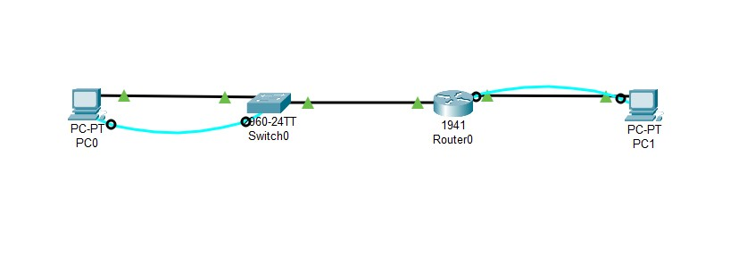
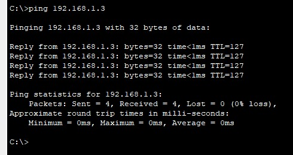

# <p align='center'> Building a Switch and Router Network </p>
## Topology
<p align='center'>

| |
|-----|
|  |

</p>

## Addressing Table 

<table border="1">
  <tr>
    <th>Device</th>
    <th>Interface</th>
    <th>IP Address</th>
    <th>Subnet Mask</th>
    <th>Default Gateway</th>
  </tr>
  <tr>
    <td rowspan="2">R1</td>
    <td>G0/0</td>
    <td>192.168.0.1</td>
    <td>255.255.255.0</td>
    <td>N/A</td>
  </tr>
  <tr>
    <td>G0/1</td>
    <td>192.168.1.1</td>
    <td>255.255.255.0</td>
    <td>N/A</td>
  </tr>
  <tr>
    <td>PC-0</td>
    <td>NIC</td>
    <td>192.168.1.3</td>
    <td>255.255.255.0</td>
    <td>192.168.1.1</td>
  </tr>
  <tr>
    <td>PC-1</td>
    <td>NIC</td>
    <td>192.168.0.3</td>
    <td>255.255.255.0</td>
    <td>192.168.0.1</td>
  </tr>
</table>


## Objectives 
- Part 1: Set Up the Topology and Initialize Devices 
- Part 2: Configure Devices and Verify Connectivity 
- Part 3: Display Device Information 

## Background / Scenario 
This is a comprehensive lab to review previously covered IOS commands. In this lab, you will cable the 
equipment as shown in the topology diagram. You will then configure the devices to match the addressing 
table. After the configurations have been saved, you will verify your configurations by testing for network 
connectivity. 
After the devices have been configured and network connectivity has been verified, you will use IOS 
commands to retrieve information from the devices to answer questions about your network equipment. 
This lab provides minimal assistance with the actual commands necessary to configure the router. Test your 
knowledge by trying to configure the devices without referring to the content or previous activities. 
Note: The routers used with CCNA hands-on labs are Cisco 1941 Integrated Services Routers (ISRs) with 
Cisco IOS Release 15.2(4)M3 (universalk9 image). The switches used are Cisco Catalyst 2960s with Cisco 
IOS Release 15.0(2) (lanbasek9 image). Other routers, switches, and Cisco IOS versions can be used. 
Depending on the model and Cisco IOS version, the commands available and output produced might vary 
from what is shown in the labs. Refer to the Router Interface Summary Table at the end of this lab for the 
correct interface identifiers. 

> [!NOTE]
> Ensure that the routers and switches have been erased and have no startup configurations. Consult 
with your instructor for the procedure to initialize and reload a router and switch. 

## Required Resources 
- Router (Cisco 1941 with Cisco IOS Release 15.2(4)M3 universal image or comparable)
- Switch (Cisco 2960 with Cisco IOS Release 15.0(2) lanbasek9 image or comparable) 
- PCs (Windows 7 or 8 with terminal emulation program, such as Tera Term) 
- Console cables to configure the Cisco IOS devices via the console ports 
- Ethernet cables as shown in the topology 

> [!NOTE]
> The Gigabit Ethernet interfaces on Cisco 1941 routers are autosensing and an Ethernet straight
through cable may be used between the router and PC-B. If using another model Cisco router, it may be 
necessary to use an Ethernet crossover cable. 

## Procedures

### Part 1: Set Up Topology and Initialize Devices 
1. **Cable the network as shown in the topology.** <br> 
   - a. Attach the devices shown in the topology diagram, and cable, as necessary. 
   - b. Power on all the devices in the topology. 
2. **Initialize and reload the router and switch.** <br>
   If configuration files were previously saved on the router and switch, initialize and reload these devices back to their basic configurations.  <br>
   [Clink here to see the commands to initialize & reload both the devices](/Initialize%20and%20Reload/README.md)

### Part 2: Configure Devices and Verify Connectivity 
1. **Configure the switch** <br> 
   [Click here to see the commands. Follow Part 4 except setp-12](/Lab01/README.md/Part4:-Configure-and-Verify-Basic-Switch-Settings)
2. **Assign static IP information to the PC interfaces.** <br>
   Configure the IP address, subnet mask, and default gateway to PC-0 & PC-1. <br>

    <table border="1">
    <tr>
        <th>Device</th>
        <th>Interface</th>
        <th>IP Address</th>
        <th>Subnet Mask</th>
        <th>Default Gateway</th>
    </tr>
    <tr>
        <td>PC-0</td>
        <td>NIC</td>
        <td>192.168.1.3</td>
        <td>255.255.255.0</td>
        <td>192.168.1.1</td>
    </tr>
    <tr>
        <td>PC-1</td>
        <td>NIC</td>
        <td>192.168.0.3</td>
        <td>255.255.255.0</td>
        <td>192.168.0.1</td>
    </tr>
    </table>

3. **Configure the router.** <br>
a. Console into the router and enable privileged EXEC mode. <br>
b. Enter configuration mode. <br>
c. Assign a device name to the router. <br> 
d. Disable DNS lookup to prevent the router from attempting to translate incorrectly entered commands as though they were host names. <br>
e. Assign class as the privileged EXEC encrypted password. <br>
f. Assign cisco as the console password and enable login. <br>
g. Assign cisco as the VTY password and enable login. <br>
h. Encrypt the clear text passwords. <br>
i. Create a banner that warns anyone accessing the device that unauthorized access is prohibited. <br>
j. Configure and activate both interfaces on the router. <br>
k. Configure an interface description for each interface indicating which device is connected to it. <br>
l. Save the running configuration to the startup configuration file. <br>
m. Set the clock on the router. <br>
n. Ping PC-1 from a command prompt window on PC-0. <br><br>

   **<u>Commands are given below. Follow these seuentially:</u>** <br>

* **Console into the switch.** <br>
   Using Tera Term, establish a console connection to the switch from PC-A. 

* **Enter privileged EXEC mode.** <br>
   ```bash
   Router> enable 
   Router# 
   ```

* **Enter configuration mode.** <br> 
   ```bash
   Router# configure terminal
   Router(config)#  
   ```

* **Give the router a name.** <br> 
   Use the hostname command to change the router name to r1. 
   ```bash
   Router(config)# hostname r1 
   r1(config)# 
   ```

* **Prevent unwanted DNS lookups.** <br> 
   To prevent the router from attempting to translate incorrectly entered commands as though they were hostnames, disable the Domain Name System (DNS) lookup. 
   ```bash
   r1(config)# no ip domain-lookup 
   r1(config)# 
   ```

* **Enter local passwords.** <br> 
   To prevent unauthorized access to the router, passwords must be configured. 
   ```bash
   r1(config)# enable secret class 
   r1(config)# line con 0 
   r1(config-line)# password cisco 
   r1(config-line)# login 
   r1(config-line)# exit 
   r1(config)# 
   ```

* **Assign cisco as the VTY password and enable login.** <br>
  ```bash
  r1(config)# line vty 0 4 
  r1(config-line)# password cisco 
  r1(config-line)# login 
  r1(config-line)# end 
  r1# 

* **To encrypt password (optional)** <br>
  ```bash
  r1> enable
  r1# configure terminal
  r1(config)# service password-encryption
  ```

* **Enter a login MOTD banner.** <br> 
  ```bash
  r1(config)# banner motd # 
  Enter TEXT message. End with the character '#'. 
  Unauthorized access is prohibited. # 
  r1(config)# exit 
  r1# 
  ```

* **Configure and activate both interfaces on the router.** <br>
  ```bash
  r1# configure terminal
  r1(config)# interface gigabitethernet 0/0
  r1(config)# ip address 192.168.0.1 255.255.255.0
  r1(config)# no shutdown
  r1(config)# exit
  r1#
  ```

  ```bash
  r1# configure terminal
  r1(config)# interface gigabitethernet 0/1
  r1(config)# ip address 192.168.1.1 255.255.255.0
  r1(config)# no shutdown
  r1(config)# exit
  r1#
  ```

* **Configure an interface description for each interface indicating which device is connected to it.** <br>
   ```bash
   r1# configure terminal
   r1(config)# interface gigabitethernet 0/0
   r1(config)# description Connected to PC-1
   r1(config)# exit
   r1#
   ```

   ```bash
   r1# configure terminal
   r1(config)# interface gigabitethernet 0/1
   r1(config)# description Connected to PC-0
   r1(config)# exit
   r1#
   ```

* **Save the configuration.** <br>
   ```bash
   r1# copy running-config startup-config 
   Destination filename [startup-config]? [Enter] 
   Building configuration... 
   [OK] 
   r1#
   ```

* **Set the clock on the router.** <br>
  ```bash
  r1# clock set 22:21:00 12 jul 2025
  r1# show clock
  ```

* **Ping PC-1 from a command prompt window on PC-0.** <br>
  Open a command prompt window (cmd.exe) on PC-A
  ```cmd
  C:\Users\NetAcad> ping 192.168.1.3
  ```

  Your output should be similar to the following screen. <br>
  


### Part 3: Display Device Information 
- Retrieve hardware and software information from Router.
- Retrieve hardware and software information from Switch.
- Use the show ip route command on the router to answer the following questions.
- Display interface information on the router.
- Display a summary list of the interfaces on the router and switch. 

```bash
R1# show version 
Switch# show version 
R1# show ip route
R1# show interfaces g0/1 
R1# show ip interface brief 
```

