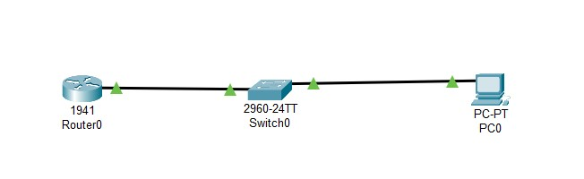

# <p align='center'> Accessing Network Devices with SSH </p>
## Topology
<p align='center'>

| |
|-----|
|  |

</p>

## Addressing Table 
| Device | Interface | IP Address   | Subnet Mask   | Default Gateway |
|--------|-----------|--------------|---------------|-----------------|
| R1     | G 0/1     | 192.168.1.1  | 255.255.255.0 | NIC             |
| S1     | VLAN 1    | 192.168.1.11 | 255.255.255.0 | 192.168.1.1     |
| PC0    | NIC       | 192.168.1.3  | 255.255.255.0 | 192.168.1.1     |

## Objectives 
Part 1: Configure Basic Device Settings <br>
Part 2: Configure the Router for SSH Access <br>
Part 3: Configure the Switch for SSH Access <br>
Part 4: SSH from the CLI on the Switch <br>

## Background / Scenario 
In the past, Telnet was the most common network protocol used to remotely configure network devices. 
Telnet does not encrypt the information between the client and server. This allows a network sniffer to 
intercept passwords and configuration information. 
Secure Shell (SSH) is a network protocol that establishes a secure terminal emulation connection to a router 
or other networking device. SSH encrypts all information that passes over the network link and provides 
authentication of the remote computer. SSH is rapidly replacing Telnet as the remote login tool of choice for 
network professionals. SSH is most often used to log in to a remote device and execute commands; however, 
it can also transfer files using the associated Secure FTP (SFTP) or Secure Copy (SCP) protocols. 
The network devices that are communicating must be configured to support SSH in order for SSH to function. 
In this lab, you will enable the SSH server on a router and then connect to that router using a PC with an SSH 
client installed. On a local network, the connection is normally made using Ethernet and IP. 

> [!NOTE]
> The routers used with CCNA hands-on labs are Cisco 1941 Integrated Services Routers (ISRs) with 
Cisco IOS Release 15.2(4)M3 (universalk9 image). The switches used are Cisco Catalyst 2960s with Cisco 
IOS Release 15.0(2) (lanbasek9 image). Other routers, switches, and Cisco IOS versions can be used. 
Depending on the model and Cisco IOS version, the commands available and the output produced might vary 
from what is shown in the labs. Refer to the Router Interface Summary Table at the end of this lab for the 
correct interface identifiers. 

> [!NOTE]
> Make sure that the routers and switches have been erased and have no startup configurations. If you 
are unsure, contact your instructor. 

## Required Resources 
- 1 Router (Cisco 1941 with Cisco IOS Release 15.2(4)M3 universal image or comparable) 
- 1 Switch (Cisco 2960 with Cisco IOS Release 15.0(2) lanbasek9 image or comparable) 
- 1 PC (Windows 7 or 8 with terminal emulation program, such as Tera Term, and Wireshark installed) 
- Console cables to configure the Cisco IOS devices via the console ports 
- Ethernet cables as shown in the topology 

## Procedures:
### Part 1: Configure a Basic Network Device 
In Part 1, you will set up the network topology and configure basic settings, such as the interface IP 
addresses, device access, and passwords on the router. <br>

1. Cable the network as shown in the topology. 
2. Initialize and reload the router and switch. [Read only <Part 3: Initialize the Switch and Reload> and return here. ](/Initialize%20and%20Reload/README.md#Part-3-Initialize-the-Switch-and-Reload)
3. Configure the Router. 
   - Console into the router and enable privileged EXEC mode. 
   - Enter configuration mode. 
   - Disable DNS lookup to prevent the router from attempting to translate incorrectly entered commands as 
though they were host names. 
   - Assign class as the privileged EXEC encrypted password. 
   - Assign cisco as the console password and enable login. 
   - Assign cisco as the VTY password and enable login. 
   - Encrypt the plaintext passwords. 
   - Create a banner that will warn anyone accessing the device that unauthorized access is prohibited. 
   - Configure and activate the G0/1 interface on the router using the information contained in the Addressing 
Table. 
   - Save the running configuration to the startup configuration file. 

   ```bash
   enable

   configure terminal

   no ip domain-lookup

   enable secret class

   line console 0
   password cisco
   login
   exit

   line vty 0 4
   password cisco
   login
   exit

   service password-encryption

   banner mot #
   Unauthorized access is prohibited. #

   interface G 0/1
   ip address 192.168.1.1 255.255.255.0
   no shut
   exit
   exit

   copy running-config startup-config
   ```


4. Configure PC-A. 
   - Configure PC-A with an IP address and subnet mask. 
   - Configure a default gateway for PC-A. 
5. Verify network connectivity. 
   - Ping R1 from PC-A. If the ping fails, troubleshoot the connection. 
  
### Part 2: Configure the Router for SSH Access 
Using Telnet to connect to a network device is a security risk because all information is transmitted in a clear 
text format. SSH encrypts the session data and provides device authentication, which is why SSH is 
recommended for remote connections. In Part 2, you will configure the router to accept SSH connections over 
the VTY lines. 

1. Configure device authentication. <br>
The device name and domain are used as part of the crypto key when it is generated. Therefore, these 
names must be entered prior to issuing the crypto key command. 
   - Configure device name. 
   ```bash
   Router(config)# hostname R1 
   ```

   - Configure the domain for the device. 
   ```bash
   R1(config)# ip domain-name ccna-lab.com 
   ```

2. Configure the encryption key method. 
   ```bash
   R1(config)# crypto key generate rsa 
   1024
   ```

3. Configure a local database username. 
   ```bash
   R1(config)# username admin privilege 15 secret adminpass 
   ```

   > [!NOTE]
   > A privilege level of 15 gives the user administrator rights. 

4. Enable SSH on the VTY lines. 
   - Enable Telnet and SSH on the inbound VTY lines using the transport input command. 
     ```bash
     R1(config)# line vty 0 4 
     R1(config-line)# transport input all
     ```

   - Change the login method to use the local database for user verification. 
     ```bash
     R1(config-line)# login local 
     R1(config-line)# end 
     R1# 
     ```

5. Save the running configuration to the startup configuration file. 
   ```bash
   R1# copy running-config startup-config 
   Destination filename [startup-config]? 
   Building configuration... 
   [OK] 
   R1#
   ```

6. Establish connection to the router. 
   Enter CLI of PC and verify:
   - Telnet
   ```cmd
   telnet 192.168.1.1 
   ```

   Provide username & password to login into the Router.
   `Username: admin`
   `Password: adminpass`

   - SSH
   ```cmd
   ssh -l admin 192.168.1.1 
   ```
   
   Provide Password to login into the Router.
   `Password: adminpass`


### Part 3: Configure the Switch for SSH Access 
In Part 3, you will configure the switch in the topology to accept SSH connections. After the switch has been 
configured, establish an SSH session using Tera Term. 

1. Configure the basic settings on the switch. 
   - Console into the switch and enable privileged EXEC mode. 
   - Enter configuration mode. 
   - Disable DNS lookup to prevent the router from attempting to translate incorrectly entered commands as 
though they were host names. 
   - Assign class as the privileged EXEC encrypted password. 
   - Assign cisco as the console password and enable login. 
   - Assign cisco as the VTY password and enable login. 
   - Encrypt the plain text passwords. 
   - Create a banner that will warn anyone accessing the device that unauthorized access is prohibited. 
   - Configure and activate the VLAN 1 interface on the switch according to the Addressing Table. 
   - Save the running configuration to the startup configuration file. 
   ```bash
   enable

   configure terminal

   no ip domain-lookup

   enable secret class

   line console 0
   password cisco
   login
   exit

   line vty 0 4
   password cisco
   login
   exit

   service password-encryption

   banner mot #
   Unauthorized access is prohibited. #

   interface vlan 1
   ip address 192.168.1.11 255.255.255.0
   no shut
   ip default-gateway 192.168.1.1 
   exit
   exit

   copy running-config startup-config
   ``` 


2. Configure the switch for SSH connectivity. <br>
   Use the same commands that you used to configure SSH on the router in Part 2 to configure SSH for the switch. 
   - Configure the device name as listed in the Addressing Table. 
   ```bash
   Switch(config)# hostname S1 
   ```

   - Configure the domain for the device. 
   ```bash
   S1(config)# ip domain-name ccna-lab.com 
   ```

   - Configure the encryption key method. 
   ```bash
   S1(config)# crypto key generate rsa 
   1024
   ```

   - Configure a local database username. 
   ```bash
   S1(config)# username admin privilege 15 secret adminpass 
   ```

   - Enable Telnet and SSH on the VTY lines. 
   ```bash
   S1(config)# line vty 0 15 
   S1(config-line)# transport input all
   ```

   - Change the login method to use the local database for user verification. 
   ```bash
   S1(config-line)# login local 
   S1(config-line)# end 
   ```

3. Establish connection to the switch. 
   Enter CLI of PC and verify:
   - Telnet
   ```cmd
   telnet 192.168.1.11 
   ```

   Provide username & password to login into the Router.
   `Username: admin`
   `Password: adminpass`

   - SSH
   ```cmd
   ssh -l admin 192.168.1.11 
   ```
   
   Provide Password to login into the Router.
   `Password: adminpass`


### Part 4: SSH From the CLI on the Switch 
The SSH client is built into the Cisco IOS and can be run from the CLI. In Part 4, you will SSH to the router 
from the CLI on the switch. 

1. View the parameters available for the Cisco IOS SSH client. 
Use the question mark (?) to display the parameter options available with the ssh command. 
   ```bash
   S1# ssh ? 
   -c    Select encryption algorithm 
   -l    Log in using this user name 
   -m    Select HMAC algorithm 
   -o    Specify options 
   -p    Connect to this port 
   -v    Specify SSH Protocol Version 
   -vrf  Specify vrf name 
   WORD  IP address or hostname of a remote system 
   ```

2. SSH to R1 from S1. 
   - You must use the –l admin option when you SSH to R1. This allows you to log in as user admin. When 
prompted, enter adminpass for the password. 
   ```bash
   S1# ssh -l admin 192.168.1.1 
   Password:  
   *********************************************** 
   Warning: Unauthorized Access is Prohibited! 
   *********************************************** 
   R1# 
   ```

   - You can return to S1 without closing the SSH session to R1 by pressing `Ctrl+Shift+6`. Release the 
`Ctrl+Shift+6` keys and press `x`. The switch privileged EXEC prompt displays. 
   ```bash
   R1# 
   S1# 
   ```

   - To return to the SSH session on R1, press Enter on a blank CLI line. You may need to press Enter a 
second time to see the router CLI prompt. 
   ```bash
   S1# 
   [Resuming connection 1 to 192.168.1.1 ... ] 
   R1# 
   ```

   - To end the SSH session on R1, type exit at the router prompt. 
   ```bash
   R1# exit 
   [Connection to 192.168.1.1 closed by foreign host] 
   S1#
   ```


<br><hr><hr><hr><br>


# <p align='center'> Securing Network Devices </p>
## Topology
<p align='center'>

| |
|-----|
|  |

</p>

## Addressing Table 
| Device | Interface | IP Address   | Subnet Mask   | Default Gateway |
|--------|-----------|--------------|---------------|-----------------|
| R1     | G 0/1     | 192.168.1.1  | 255.255.255.0 | NIC             |
| S1     | VLAN 1    | 192.168.1.11 | 255.255.255.0 | 192.168.1.1     |
| PC0    | NIC       | 192.168.1.3  | 255.255.255.0 | 192.168.1.1     |

## Objectives:
Part 1: Configure Basic Device Settings <br>
Part 2: Configure Basic Security Measures on the Router <br> 
Part 3: Configure Basic Security Measures on the Switch <br>

## Background / Scenario 
It is recommended that all network devices be configured with at least a minimum set of best practice security 
commands. This includes end user devices, servers, and network devices, such as routers and switches. 
In this lab, you will configure the network devices in the topology to accept SSH sessions for remote 
management. You will also use the IOS CLI to configure common, basic best practice security measures. You 
will then test the security measures to verify that they are properly implemented and working correctly. 

> [!NOTE]
> The routers used with CCNA hands-on labs are Cisco 1941 ISRs with Cisco IOS Release 15.2(4)M3 
(universalk9 image). The switches used are Cisco Catalyst 2960s with Cisco IOS Release 15.0(2) (lanbasek9 
image). Other routers, switches, and Cisco IOS versions can be used. Depending on the model and Cisco 
IOS version, the commands available and output produced might vary from what is shown in the labs. Refer 
to the Router Interface Summary table at the end of the lab for the correct interface identifiers. 

> [!NOTE]
> Make sure that the routers and switches have been erased and have no startup configurations. If you 
are unsure, contact your instructor.

## Required Resources 
- 1 Router (Cisco 1941 with Cisco IOS software, release 15.2(4)M3 universal image or comparable) 
- 1 Switch (Cisco 2960 with Cisco IOS Release 15.0(2) lanbasek9 image or comparable) 
- 1 PC (Windows 7 or 8 with terminal emulation program, such as Tera Term) 
- Console cables to configure the Cisco IOS devices via the console ports 
- Ethernet cables as shown in the topology 

## Procedures:
### Part 1: Configure Basic Device Settings 
In Part 1, you will set up the network topology and configure basic settings, such as the interface IP addresses, device access, and passwords on the devices. 
1. Cable the network as shown in the topology. 
2. Initialize and reload the router and switch. [Read only <Part 3: Initialize the Switch and Reload> and return here. ](/Initialize%20and%20Reload/README.md#Part-3-Initialize-the-Switch-and-Reload)
3. Configure the router and switch. 
   - Console into the device and enable privileged EXEC mode. 
   - Assign the device name according to the Addressing Table. 
   - Disable DNS lookup to prevent the router from attempting to translate incorrectly entered commands as though they were hostnames. 
   - Assign class as the privileged EXEC encrypted password. 
   - Assign cisco as the console password and enable login. 
   - Assign cisco as the VTY password and enable login. 
   - Create a banner that warns anyone accessing the device that unauthorized access is prohibited. 
   - Configure and activate the G0/1 interface on the router using the information contained in the Addressing Table. 
   - Configure the default SVI on the switch with the IP address information according to the Addressing Table. 
   - Save the running configuration to the startup configuration file. 
   ```bash
   enable
   configure terminal
   hostname R1 ! for router
   hostname S1 ! for switch

   no ip domain-lookup

   enable secret class

   line console 0
   password cisco
   login
   exit

   line vty 0 4
   password cisco
   login
   exit

   banner mot #
   Unauthorized access is prohibited. #

   ! for router
   interface G 0/1
   ip address 192.168.1.1 255.255.255.0
   no shut
   exit
   exit
   
   ! for router
   interface vlan 1
   ip address 192.168.1.11 255.255.255.0
   no shut
   ip default-gateway 192.168.1.1 
   exit
   exit

   copy running-config startup-config
   ```


### Part 2: Configure Basic Security Measures on the Router 
1. Encrypt the clear text passwords. 
   ```bash
   R1(config)# service password-encryption 
   ```

2. Strengthen passwords. <br>
An administrator should ensure that passwords meet the standard guidelines for strong passwords. These guidelines could include combining letters, numbers and special characters in the password and setting a minimum length.  
   - Change the privileged EXEC encrypted password to meet guidelines. 
   ```bash
   R1(config)# enable secret Enablep@55 
   ```

   - Require that a minimum of 10 characters be used for all passwords. 
   ```bash
   R1(config)# security passwords min-length 10 
   ```

3. Enable SSH connections. 
   - Assign the domain name as CCNA-lab.com. 
   ```bash
   R1(config)# ip domain-name CCNA-lab.com 
   ```

   - Create a local user database entry to use when connecting to the router via SSH. The password should meet strong password standards, and the user should have user EXEC access. If privilege level is not specified in the command, the user will have user EXEC (level 15) access by default. 
   ```bash
   R1(config)# username SSHadmin privilege 1 secret Admin1p@55 
   ```

   - Configure the transport input for the VTY lines so that they accept SSH connections, but do not allow Telnet connections. 
   ```bash
   R1(config)# line vty 0 4 
   R1(config-line)# transport input ssh 
   ```

   - The VTY lines should use the local user database for authentication. 
   ```bash
   R1(config-line)# login local 
   R1(config-line)# exit 
   ```

   - Generate a RSA crypto key using a modulus of 1024 bits. 
   ```bash
   R1(config)# crypto key generate rsa 
   1024
   ```

4. Secure the console and VTY lines. 
   - You can set the router to log out of a connection that has been idle for a specified time. If a network administrator was logged into a networking device and was suddenly called away, this command automatically logs the user out after the specified time. The following commands cause the line to log out after five minutes of inactivity. 
   ``bash
   R1(config)# line console 0 
   R1(config-line)# exec-timeout 5 0 
   R1(config-line)# line vty 0 4 
   R1(config-line)# exec-timeout 5 0 
   R1(config-line)# exit 
   R1(config)#
   ```

   - The following command impedes brute force login attempts. The router blocks login attempts for 30 seconds if someone fails two attempts within 120 seconds. This timer is set especially low for the purpose of this lab. 
   ```bash
   R1(config)# login block-for 30 attempts 2 within 120 
   ```

5. Verify that all unused ports are disabled. <br>
   Router ports are disabled by default, but it is always prudent to verify that all unused ports are in an administratively down state. This can be quickly checked by issuing the show ip interface brief command. Any unused ports that are not in an administratively down state should be disabled using the shutdown command in interface configuration mode.
   ```bash
   R1# show ip interface brief 
   Interface                  IP-Address      OK? Method Status                Protocol 
   Embedded-Service-Engine0/0 unassigned      YES NVRAM  administratively down down     
   GigabitEthernet0/0         unassigned      YES NVRAM  administratively down down     
   GigabitEthernet0/1         192.168.1.1     YES manual up                    up       
   Serial0/0/0                unassigned      YES NVRAM  administratively down down     
   Serial0/0/1                unassigned      YES NVRAM  administratively down down     
   R1# 
   ```

6. Verify that your security measures have been implemented correctly. 
   - Use Tera Term to telnet to R1. The connection is refused. Telnet was disabled with the transport input ssh command. 
   - Use Tera Term to SSH to R1. 
   - Intentionally mistype the user and password information to see if login access is blocked after two attempts. 
   - From your console session on the router, issue the show login command to view the login status. In the example below, the show login command was issued within the 30 second login blocking period and shows that the router is in Quiet-Mode. The router will not accept any login attempts for 14 more seconds. 
   ```bash
   R1# show login 
   A default login delay of 1 second is applied. 
   No Quiet-Mode access list has been configured. 
   Router enabled to watch for login Attacks. 
   If more than 2 login failures occur in 120 seconds or less, 
   logins will be disabled for 30 seconds. 
   Router presently in Quiet-Mode. 
   Will remain in Quiet-Mode for 14 seconds. 
   Denying logins from all sources. 
   R1# 
   ```

### Part 3: Configure Basic Security Measures on the Switch 
1. Encrypt the clear text passwords. 
   ```bash
   S1(config)# service password-encryption 
   ```

2. Strengthen Passwords on the switch. <br>
   Change the privileged EXEC encrypted password to meet strong password guidelines. 
   ```bash
   S1(config)# enable secret Enablep@55 
   ```

> [!NOTE]
> The security password min-length command is not available on the 2960 switch. 

3. Enable SSH Connections. 
   - Assign the domain-name as CCNA-lab.com 
   ```bash
   S1(config)# ip domain-name CCNA-lab.com 
   ```

   - Create a local user database entry for use when connecting to the switch via SSH. The password should meet strong password standards, and the user should have user EXEC access. If privilege level is not specified in the command, the user will have user EXEC (level 1) access by default. 
   ```bash
   S1(config)# username SSHadmin privilege 1 secret Admin1p@55 
   ```

   - Configure the transport input for the VTY lines to allow SSH connections but not allow Telnet connections. 
   ```bash
   S1(config)# line vty 0 15 
   S1(config-line)# transport input ssh 
   ```

   - The VTY lines should use the local user database for authentication. 
   ```bash
   S1(config-line)# login local 
   S1(config-line)# exit 
   ```

   - Generate an RSA crypto key using a modulus of 1024 bits. 
   ```bash
   S1(config)# crypto key generate rsa 
   1024
   ```

4. Secure the console and VTY lines. 
   - Configure the switch to log out a line that has been idle for 10 minutes. 
   ```bash
   S1(config)# line console 0 
   S1(config-line)# exec-timeout 10 0 
   ```

5. Verify all unused ports are disabled. <br>
   Switch ports are enabled, by default. Shut down all ports that are not in use on the switch. 
   - You can verify the switch port status using the show ip interface brief command. 
   ```bash
   S1# show ip interface brief 
   ```

   - Use the interface range command to shut down multiple interfaces at a time. 
   ```bash
   S1(config)# interface range f0/1–4 , f0/7-24 , g0/1-2 
   S1(config-if-range)# shutdown 
   S1(config-if-range)# end 
   ```

   - Verify that all inactive interfaces have been administratively shut down. 
   ```bash
   S1# show ip interface brief 
   ```

6. Verify that your security measures have been implemented correctly. 
   - Verify that Telnet has been disabled on the switch. 
   - SSH to the switch and intentionally mistype the user and password information to see if login access is blocked. 
   - After the 30 seconds has expired, SSH to S1 again and log in using the SSHadmin username and Admin1p@55 for the password. 
   - Enter privileged EXEC mode using Enablep@55 as the password. 
   - Issue the show running-config command at the privileged EXEC prompt to view the security settings 
you have applied.