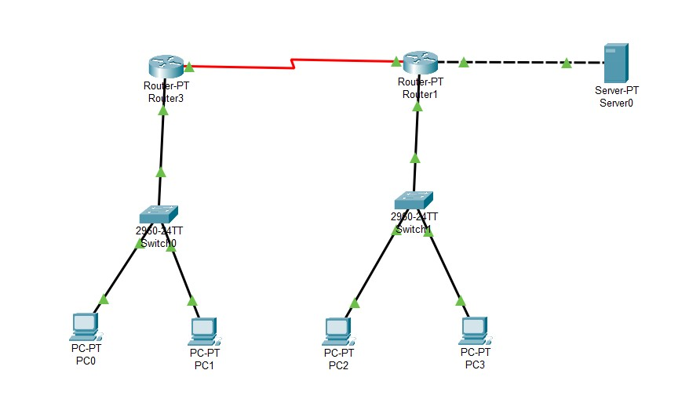
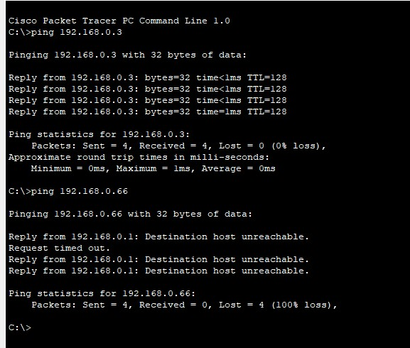
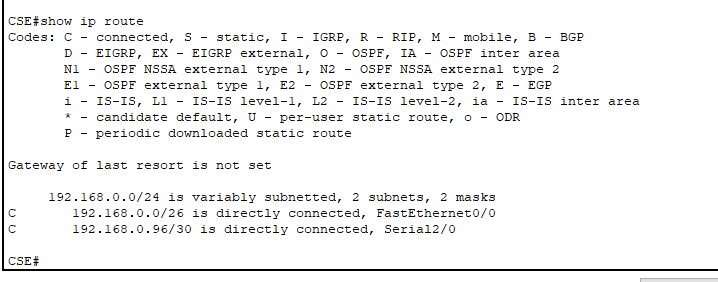
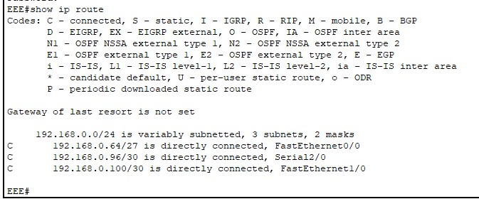
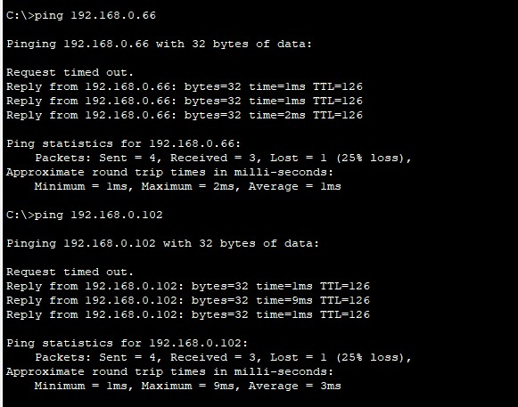
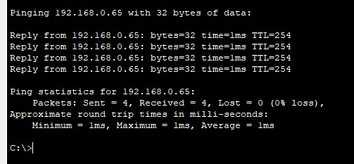
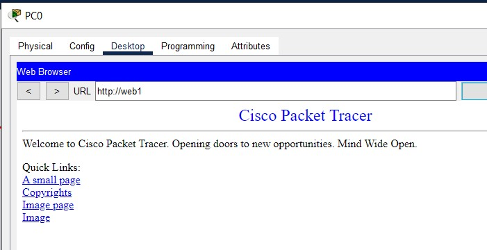
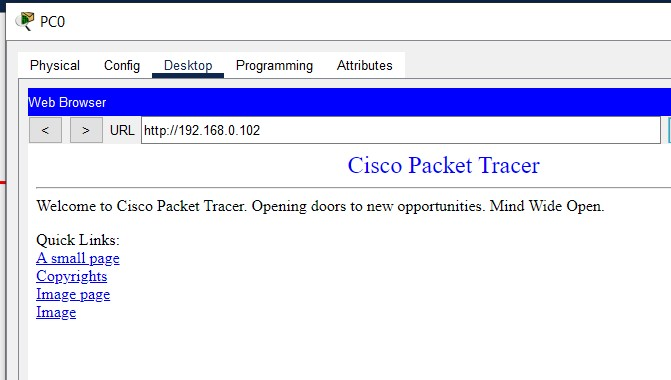
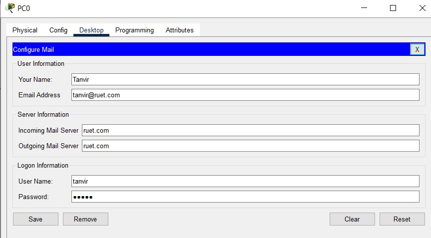

# <p align='center'> Configuring A Basic Network </p>
## Topology
<p align='center'>

| |
|-----|
|  |

</p>

## Addressing Table 
Major network: `192.168.0.0/24`<br>
Using VLSM to divide the network into 4 subnets. You may use [VLSM Calculator](https://vlsmcalc.vercel.app/) <br>

<table border="1">
  <tr>
    <th>Device</th>
    <th>Interface</th>
    <th>IP Address</th>
    <th>Subnet Mask</th>
    <th>Default Gateway</th>
    <th>DNS</th>
  </tr>
  <tr>
    <td rowspan="2">CSE</td>
    <td>Fa 0/0</td>
    <td>192.168.0.1</td>
    <td>255.255.255.192</td>
    <td>N/A</td>
    <td>N/A</td>
  </tr>
  <tr>
    <td>Se 2/0</td>
    <td>192.168.0.97</td>
    <td>255.255.255.252</td>
    <td>N/A</td>
    <td>N/A</td>
  </tr>
  <tr>
    <td rowspan="3">EEE</td>
    <td>Fa 0/0</td>
    <td>192.168.0.65</td>
    <td>255.255.255.224</td>
    <td>N/A</td>
    <td>N/A</td>
  </tr>
  <tr>
    <td>Se 2/0</td>
    <td>192.168.0.9</td>
    <td>255.255.255.252</td>
    <td>N/A</td>
    <td>N/A</td>
  </tr>
  <tr>
    <td>Fa 1/0</td>
    <td>192.168.0.101</td>
    <td>255.255.255.252</td>
    <td>N/A</td>
    <td>N/A</td>
  </tr>
  <tr>
    <td>PC-0</td>
    <td>NIC</td>
    <td>192.168.0.2</td>
    <td>255.255.255.192</td>
    <td>192.168.0.1</td>
    <td>252.168.0.102</td>
  </tr>
  <tr>
    <td>PC-1</td>
    <td>NIC</td>
    <td>192.168.0.3</td>
    <td>255.255.255.192</td>
    <td>192.168.0.1</td>
    <td>252.168.0.102</td>
  </tr>
  <tr>
    <td>PC-2</td>
    <td>NIC</td>
    <td>192.168.0.66</td>
    <td>255.255.255.224</td>
    <td>192.168.0.65</td>
    <td>252.168.0.102</td>
  </tr>
  <tr>
    <td>PC-3</td>
    <td>NIC</td>
    <td>192.168.0.67</td>
    <td>255.255.255.224</td>
    <td>192.168.0.65</td>
    <td>252.168.0.102</td>
  </tr>
  <tr>
    <td>Server</td>
    <td>NIC</td>
    <td>192.168.0.102</td>
    <td>255.255.255.252</td>
    <td>192.168.0.101</td>
    <td>252.168.0.102</td>
  </tr>
</table>

## Objectives 
Part 1: Configure the basic configuration of Router: CSE & EEE. <br>
Part 2: Test the connectings among all end devices. <br>
Part 3: Configure Web and Email services on the network. <br>

> [!NOTE]
> Note here

## Required Resources 
- 2 Router PT
- 2 Switch (2960)
- 4 PC 
- Console cables to configure the Cisco IOS devices via the console ports 
- Straight-through cable to connects unlike network devices (Router-Switch, Switch-PC).
- Serial DCE to connect the Routers.
- Crossover cable to connect Router with Server.

## Procedures:
### Part 1: Configure the basic configuration of Router: CSE & EEE.
1. For CSE Router:
   ```bash
   enable
   configure terminal
   hostname CSE
   no ip domain-lookup

   enable secret class
   line console 0
   password cisco
   login exit
   line vty 0 4
   password cisco
   login
   exit

   service password-encryption

   configure terminal
   interface fa 0/0
   ip address 192.168.0.97 255.255.255.252
   no shut
   exit

   interface se 2/0
   ip address 192.168.0.97 255.255.255.252
   no shut
   exit
   exit
   exit

   copy running-config startup-config
   ```

2. For EEE Router:
   ```bash
   enable
   configure terminal
   hostname EEE
   no ip domain-lookup

   enable secret class
   line console 0
   password cisco
   login exit
   line vty 0 4
   password cisco
   login
   exit

   service password-encryption

   configure terminal
   interface fa 0/0
   ip address 192.168.0.65 255.255.255.224
   no shut
   exit

   interface se 2/0
   ip address 192.168.0.98 255.255.255.252
   no shut
   exit

   interface fa 1/0
   ip address 192.168.0.101 255.255.255.252
   no shut
   exit

   exit
   exit

   copy running-config startup-config
   ```

3. Add IP address, Subnet mask, Gateway to all PCs.

### Part 2: Test the connectings among all end devices.
1. Try to ping PC1 and PC2 from PC0. You will be able to ping PC1 (as they are in same network) but not in PC2 (as they are in different networks).
   

2. Now, click CSE router and nter in EXEC previlized mode. Then obswerve the routing table of CSE Router:
   ```bash
   show ip route
   ```
   

   So, you need to add information of EEE Router to CSE Router. You will do this in step 3. <br>
   Do the sdame task for EEE Router to observe Routing table. <br>
   

3. Enter EXEC previlized mode of CSE Router and tye:
   ```bash
   ip route 192.168.0.64 255.255.255.224 se 2/0
   ip route 192.168.0.100 255.255.255.252 se 2/0
   
   interface se 2/0
   clock rate 64000
   exit
   exit

   copy running-config startup-config
   ```

   It will add information of EEE network and Server network. <br> <br>

   Similarly: Enter EXEC previlized mode of EEE Router and tye:
   ```bash
   ip route 192.168.0.0 255.255.255.192 se 2/0

   exit

   copy running-config startup-config
   ```

   It will add information of CSE network.

4. Now, all the devices are connected and start testing connection using `ping` in terminal.
    <br>
   
    
   
### Part 3: Configure Web and Email services on the network.

1. To configure Web services:
   - Click on `Server`, then `services > HTTP`, enable HTTP and HTTPS. <br>
   Now, you will be able to access these HTML files (stored in server) from any PC using Server IP address as URL link. In order to search by
   site name, you need to configure DNS server. 
   - Click `service > DNS`, and turn on DNS service. <br>
   Add domain name and address: <br>

      | Task                    | Domain name | Address       |
      |-------------------------|-------------|---------------|
      |Domain for Web service   | web1        | 192.168.0.102 |
      |Domain for Email service | ruet.com    | 192.168.0.102 |

   - Add DNS address `192.168.0.102` in all PCs.

   Now, click on any PC and open browser. Access the web service by searching: `web1` or `192.168.0.1052`.
   <br>

   | | |
   |-----|------|
   |  | 

2. To configure Email service:
   - Click on the `Server`, then `services > EMAIL`, enable `SMTP` and `POP3`. <br>
   - Set domain name: `ruet.com` and then click on set.
   - Add User and Password: <br>

   | User   | Password |
   |--------|----------|
   | tanvir | cisco    | 
   | foyez  | cisco    | 
   | asif   | cisco    | 
   | shifat | cisco    | 

   - Configure the first PC's Email as: <br>
   

   - Configure other PC with respective users as previous table.
   - Try to send and receive mails.
