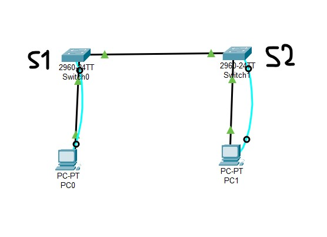

# Cisco Packet Tracer (Computer Network Lab)
This repository contains .pkt simulation files created using Cisco Packet Tracer for various computer network lab exercises. It is intended to support students and enthusiasts who want to practice and explore the fundamentals of computer networking through simulation.

## 📚 Basic Definitions
Before diving into the simulations, here are a few essential terms in computer networking:

- **Computer Network:** A computer network is a group of interconnected computers that share resources and information. These networks can be wired or wireless and vary in scale from small local networks (LANs) to wide-area networks (WANs) like the Internet.

- **Host:** A host is any device (such as a computer, server, or smartphone) that can send or receive data on a network. Each host typically has an IP address for identification.

- **Router:** A router is a network device that connects different networks together. It forwards data packets between computer networks and determines the best path for data to travel.

- **Switch:** A switch is a device that connects multiple devices within the same network (usually a LAN) and uses MAC addresses to forward data to the correct destination.

- **Packet Tracer:** Cisco Packet Tracer is a powerful simulation tool developed by Cisco that allows users to create virtual network topologies, configure devices, and simulate network behavior without physical hardware.

## 🛠️ Installation Guide: Cisco Packet Tracer
To run the .pkt files provided in this repository, you need to have Cisco Packet Tracer installed on your system.

### 🔽 Step 1: Download
Visit the official [Cisco Networking Academy site](https://www.netacad.com/)
Create a free account (if you don't have one).
Navigate to `Resources → Download Packet Tracer` after logging in.
Download the appropriate version for your operating system (Windows/Linux/macOS).

> [!NOTE]
> I have installed Cisco Packet Tracer v8.2.2 from [here](https://www.netacad.com/articles/news/download-cisco-packet-tracer).

### 💻 Step 2: Install
- Windows:
  Run the .exe installer and follow the setup instructions.
  After installation, log in using your NetAcad credentials.

- Linux:
  - Download the .deb or .tar.gz file depending on your distro.
  - Install using the terminal (sudo dpkg -i file_name.deb) or extract and run the binary.


# <p align='center'> [Lab 01](/Lab01/) (Building a Simple Network) </p>
## Topology


## Addressing Table 
| Device | Interface | IP Address   | Subnet Mask   |
|--------|-----------|--------------|---------------|
| PC0    | NIC       | 192.168.1.10 | 255.255.255.0 |
| PC1    | NIC       | 192.168.1.11 | 255.255.255.0 |

## Objectives 
- Part 1: Initializing and Reloading Switch.
- Part 2: Set Up the Network Topology (Ethernet only) 
- Part 3: Configure PC Hosts 
- Part 4: Configure and Verify Basic Switch Settings 
- Part 5: Login and Logout Switch

## Required Resources 
- 2 Switches (Cisco 2960 with Cisco IOS Release 15.0(2) lanbasek9 image or comparable) 
- 2 PCs 
- Console cables to configure the Cisco IOS devices via the console ports 
- Ethernet cables as shown in the topology 


> [!NOTE]
>  The Ethernet ports on the 2960 switches are autosensing and will accept either a straight
through or a cross-over cable for all connections. If the switches used in the topology are other than the 2960 
model, then it is likely that a cross-over cable will be needed to connect the two switches.

> [!NOTE]
>  Make sure that the switches have been erased and have no startup configurations. Refer to Appendix A 
for the procedure to initialize and reload a switch. 

## Procedures:

### Part1: Initializing and Reloading Switch
1. Attach a **Switch** with a PC0 using console cable.
2. Power on the devices.
3. Click on the PC0 > Desktop tab > terminal.
4. Leave the default settings (Baud rate: 9600, etc.) → Click OK.
5. Press enter to type commands in the terminal.
6. Enter privileged EXEC mode. 
   ```bash
   Switch> enable 
   Switch# 
   ```

7. Determine if there have been any virtual local-area networks (VLANs) created. 
   ```bash
   Switch# show flash
   ```

8. If `vlan.dat ` file is found, delete the `VLAN file`.
   ```bash
   Switch# delete vlan.dat 
   Delete filename [vlan.dat]? 
   ```

   You will be prompted to verify the file name. At this point, you can change the file name or just press 
   Enter if you have entered the name correctly.

   When you are prompted to delete this file, press Enter to confirm the deletion. (Pressing any other key will 
   abort the deletion.) 
   ```bash
   Delete flash:/vlan.dat? [confirm] 
   Switch# 
   ```

9. Erase the startup configuration file. 
   Use the erase startup-config command to erase the startup configuration file from NVRAM. When you are 
   prompted to remove the configuration file, press Enter to confirm the erase. (Pressing any other key will abort 
   the operation.) 
   ```bash
   Switch# erase startup-config 
   Erasing the nvram filesystem will remove all configuration files! Continue? [confirm] 
   [OK] 
   Erase of nvram: complete 
   Switch# 
   ```

10. Reload the switch. 
    Reload the switch to remove any old configuration information from memory. When you are prompted to 
    reload the switch, press Enter to proceed with the reload. (Pressing any other key will abort the reload.) 
    ```bash
    Switch# reload 
    Proceed with reload? [confirm]
    ```

    > [!NOTE]
    > You may receive a prompt to save the running configuration prior to reloading the switch. Type no and press Enter. 

    ```bash
    System configuration has been modified. Save? [yes/no]: no 
    ```

11. Bypass the initial configuration dialog. 
    After the switch reloads, you should see a prompt to enter the initial configuration dialog. Type no at the prompt and press Enter. 
    ```bash
    Would you like to enter the initial configuration dialog? [yes/no]: no 
    Switch>
    ```  


> [!NOTE]
> The Ethernet ports on the 2960 switches are autosensing and will accept either a straight through or a cross-over cable for all connections. If the switches used in the topology are other than the 2960  model, then it is likely that a cross-over cable will be needed to connect the two switches. 

### Part2; Set Up the Network Topology (Ethernet only) 
1. Power on the devices. 
   Power on all devices in the topology. The switches do not have a power switch; they will power on as soon as you plug in the power cord. 
2. Connect the two switches. 
   Connect one end of an Ethernet cable to F0/1 on S1 and the other end of the cable to F0/1 on S2. You should  see the lights for F0/1 on both switches turn amber and then green. This indicates that the switches have been connected correctly. 
3. Connect the PCs to their respective switches. 
   - Connect one end of the second Ethernet cable to the NIC port on PC-A. Connect the other end of the  cable to F0/6 on S1. After      connecting the PC to the switch, you should see the light for F0/6 turn amber 
     and then green, indicating that PC-A has been connected correctly.    
   - Connect one end of the last Ethernet cable to the NIC port on PC-B. Connect the other end of the cable 
     to F0/18 on S2. After connecting the PC to the switch, you should see the light for F0/18 turn amber and 
     then green, indicating that the PC-B has been connected correctly.
4. Visually inspect network connections. 
   After cabling the network devices, take a moment to carefully verify the connections to minimize the time 
   required to troubleshoot network connectivity issues later.
### Part3: Configure PC Hosts 
1. Set the IP addresss to each host as instructed.

### Part4: Configure and Verify Basic Switch Settings 
1. Console into the switch. 
   Using Tera Term, establish a console connection to the switch from PC-A. 

2. Enter privileged EXEC mode. 
   You can access all switch commands in privileged EXEC mode. The privileged EXEC command set includes those commands contained in user EXEC mode, as well as the configure command through which access to the remaining command modes are gained. Enter privileged EXEC mode by entering the enable command. 
   ```bash
   Switch> enable 
   Switch# 
   ```

   The prompt changed from Switch> to Switch# which indicates privileged EXEC mode. 

3. Enter configuration mode. 
   Use the configuration terminal command to enter configuration mode. 
   ```bash
   Switch# configure terminal 
   ```

   Enter configuration commands, one per line. End with CNTL/Z. 
   ```bash
   Switch(config)# 
   The prompt changed to reflect global configuration mode. 
   ```

4. Give the switch a name. 
   Use the hostname command to change the switch name to S1. 
   ```bash
   Switch(config)# hostname S1 
   S1(config)# 
   ```

5. Prevent unwanted DNS lookups. 
   To prevent the switch from attempting to translate incorrectly entered commands as though they were hostnames, disable the Domain Name System (DNS) lookup. 
   ```bash
   S1(config)# no ip domain-lookup 
   S1(config)# 
   ```

6. Enter local passwords. 
   To prevent unauthorized access to the switch, passwords must be configured. 
   ```bash
   S1(config)# enable secret class 
   S1(config)# line con 0 
   S1(config-line)# password cisco 
   S1(config-line)# login 
   S1(config-line)# exit 
   S1(config)# 
   ```

7. Enter a login MOTD banner. 
   A login banner, known as the message of the day (MOTD) banner, should be configured to warn anyone accessing the switch that unauthorized access will not be tolerated. The banner motd command requires the use of delimiters to identify the content of the banner message. The  delimiting character can be any character as long as it does not occur in the message. For this reason, symbols, such as the #, are often used. 
   ```bash
   S1(config)# banner motd # 
   Enter TEXT message. End with the character '#'. 
   Unauthorized access is strictly prohibited and prosecuted to the full extent of the law. # 
   S1(config)# exit 
   S1# 
   ```

8. Save the configuration. 
   Use the copy command to save the running configuration to the startup file on non-volatile random access memory (NVRAM). 
   ```bash
   S1# copy running-config startup-config 
   Destination filename [startup-config]? [Enter] 
   Building configuration... 
   [OK] 
   S1#
   ```
9. Display the current configuration. 
   The show running-config command displays the entire running configuration, one page at a time. Use the spacebar to advance paging. The commands configured in Steps 1 – 8 are highlighted below. 
   ```bash
   S1# show running-config 
   ```

10. Display the IOS version and other useful switch information. 
    Use the show version command to display the IOS version that the switch is running, along with other useful information. Again, you will  need to use the spacebar to advance through the displayed information. 
    ```bash
    S1# show version 
    ```
  
11. Display the status of the connected interfaces on the switch. 
    To check the status of the connected interfaces, use the show ip interface brief command. Press the spacebar to advance to the end of the list. 
    ```bash
    S1# show ip interface brief
    ```

12. Repeat these same process to configure second switch.
    The only difference for this step is to change the hostname to S2.


### How to login?
Connect a pc with S1 using console cable.the console cable is what gives terminal access (for initial configuration and login). 
The Ethernet cable is for network communication (ping, telnet, etc.).

1. Click on PC0 in Packet Tracer.
2. Click Desktop tab.
3. Click Terminal.
4. Leave the default settings (Baud rate: 9600, etc.) → Click OK.
5. If the switch is correctly configured, you'll see:
```makefile
User Access Verification
Password:
```

6. Enter: `cisco` (your console password)
7. Then, to enter privileged EXEC mode:
```pgsql
Switch> enable
Password: 
```
8. Enter `class` as password.

📝 Important Notes
✅ You configured:
```bash
line con 0
password cisco
login
```

That means the console access now requires password `cisco`.

✅ You configured:

```bash
enable secret class
```

That means enable mode requires password `class`.

### How to logout?
Type: 
```bash
exit
```


## 📝 License

This project is licensed under the [MIT License](./LICENSE). Feel free to use, modify, and distribute the lab files for educational purposes.
