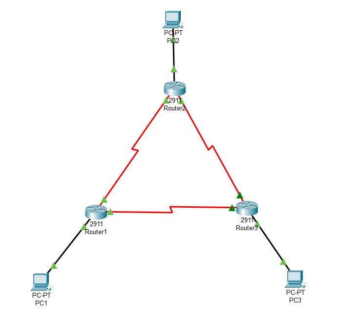

# <p align='center'> Configuring Basic EIGRP for IPv4 </p>
## Topology
<p align='center'>

| |
|-----|
|  |

</p>

## Addressing Table 

<table border="1">
  <tr>
    <th>Device</th>
    <th>Interface</th>
    <th>IP Address</th>
    <th>Subnet Mask</th>
    <th>Default Gateway</th>
  </tr>

  <tr>
    <td rowspan="3">R1</td>
    <td>G0/0</td>
    <td>192.168.1.1</td>
    <td>255.255.255.0</td>
    <td>N/A</td>
  </tr>
  <tr>
    <td>S0/0/0(DCE)</td>
    <td>10.1.1.1</td>
    <td>255.255.255.252</td>
    <td>N/A</td>
  </tr>
  <tr>
    <td>S0/0/1</td>
    <td>10.3.3.1</td>
    <td>255.255.255.252</td>
    <td>N/A</td>
  </tr>

  <tr>
    <td rowspan="3">R2</td>
    <td>G0/0</td>
    <td>192.168.2.1</td>
    <td>255.255.255.0</td>
    <td>N/A</td>
  </tr>
  <tr>
    <td>S0/0/0</td>
    <td>10.1.1.2</td>
    <td>255.255.255.252</td>
    <td>N/A</td>
  </tr>
  <tr>
    <td>S0/0/1(DCE)</td>
    <td>10.2.2.2</td>
    <td>255.255.255.252</td>
    <td>N/A</td>
  </tr>
  <tr>

  <tr>
    <td rowspan="3">R3</td>
    <td>G0/0</td>
    <td>192.168.3.1</td>
    <td>255.255.255.0</td>
    <td>N/A</td>
  </tr>
  <tr>
    <td>S0/0/0(DCE)</td>
    <td>10.3.3.2</td>
    <td>255.255.255.252</td>
    <td>N/A</td>
  </tr>
  <tr>
    <td>S0/0/1</td>
    <td>10.2.2.1</td>
    <td>255.255.255.252</td>
    <td>N/A</td>
  </tr>
  <tr>

  <tr>
    <td>PC-1</td>
    <td>NIC</td>
    <td>192.168.1.3 </td>
    <td>255.255.255.0</td>
    <td>192.168.1.1</td>
  </tr>
  <tr>
    <td>PC-2</td>
    <td>NIC</td>
    <td>192.168.2.3 </td>
    <td>255.255.255.0</td>
    <td>192.168.2.1</td>
  </tr>
  <tr>
    <td>PC-3</td>
    <td>NIC</td>
    <td>192.168.3.3 </td>
    <td>255.255.255.0</td>
    <td>192.168.3.1</td>
  </tr>
  
</table>

## Objectives 
- Part 1: Build the Network and Verify Connectivity <br>
- Part 2: Configure EIGRP Routing <br>
- Part 3: Verify EIGRP Routing <br>
- Part 4: Configure Bandwidth and Passive Interfaces <br> 

## Background / Scenario 
Enhanced Interior Gateway Routing Protocol (EIGRP) is a powerful distance vector routing protocol and is 
relatively easy to configure for basic networks. 
In this lab, you will configure EIGRP for the topology and networks shown above. You will modify bandwidth 
and configure passive interfaces to allow EIGRP to function more efficiently. 

> [!NOTE]
> The routers used with CCNA hands-on labs are Cisco 1941 Integrated Services Routers (ISRs) with 
Cisco IOS Release 15.2(4)M3 (universalk9 image). Other routers and Cisco IOS versions can be used. 
Depending on the model and Cisco IOS version, the commands available and output produced might vary 
from what is shown in the labs. Refer to the Router Interface Summary Table at the end of this lab for the 
correct interface identifiers. 

> [!NOTE]
> Make sure that the routers have been erased and have no startup configurations. If you are unsure, 
contact your instructor. 


## Required Resources 
- 3 Routers (Cisco 1941 with Cisco IOS Release 15.2(4)M3 universal image or comparable) 
- 3 PCs (Windows 7, Vista, or XP with terminal emulation program, such as Tera Term) 
- Console cables to configure the Cisco IOS devices via the console ports 
- Ethernet and serial cables as shown in the topology 

## Procedures:
### Part 1: Build the Network and Verify Connectivity
1. Cable the network as shown in the topology. 
2. Configure PC hosts. 
3. Initialize and reload the routers as necessary. 
4. Configure basic settings for each router. 
   - Disable DNS lookup. 
   - Configure IP addresses for the routers, as listed in the Addressing Table. 
   - Configure device name as shown in the topology. 
   - Assign cisco as the console and vty passwords. 
   - Assign class as the privileged EXEC password. 
   - Configure logging synchronous to prevent console and vty messages from interrupting command entry. 
   - Configure a message of the day. 
   - Copy the running configuration to the startup configuration. 
5. Verify connectivity. 
The routers should be able to ping one another, and each PC should be able to ping its default gateway. The 
PCs will not be able to ping other PCs until EIGRP routing is configured. 

<br> Configuration of R1 Router: 
```bash
enable
erase startup-configuration
reload

enable
configure terminal
hostname R1
no ip domain-lookup

enable secret class

line console 0
password cisco
login
exit

line vty 0 4
password cisco
login exit

service password-encryption

banner motd #
Unauthorized access is prohibited. #

line console 0
logging synchronous
exit

line vty 0 4
logging synchronous
exit

interface g0/0
ip address 192.168.1.1 255.255.255.0
no shut
exit 

interface s0/0/0
ip address 10.1.1.1 255.255.255.252
no shut
exit

interface s0/0/1
ip address 10.3.3.1 255.255.255.252
no shut
exit

exit
copy running-config startup-config
```

<br> Configuration of R2 Router: (Same as before)
```bash
interface g0/0
ip address 192.168.2.1 255.255.255.0
no shut
exit 

interface s0/0/0
ip address 10.1.1.2 255.255.255.252
no shut
exit

interface s0/0/1
ip address 10.2.2.2 255.255.255.252
no shut
exit
```

<br> Configuration of R3 Router: (Same as before)
```bash
interface g0/0
ip address 192.168.3.1 255.255.255.0
no shut
exit 

interface s0/0/0
ip address 10.3.3.2 255.255.255.252
no shut
exit

interface s0/0/1
ip address 10.2.2.1 255.255.255.252
no shut
exit
```

To add clock rate, type
```bash
clock rate 64000
```
in interface.


### Part 2: Configure EIGRP Routing 

Enable EIGRP routing on R1. Use AS number 10. \

```bash
R1(config)# router eigrp 10 
R1(config-router)# network 10.1.1.0 0.0.0.3 
R1(config-router)# network 192.168.1.0 0.0.0.255 
R1(config-router)# network 10.3.3.0 0.0.0.3 
R1(config-router)# no auto-summary
```

```bash
R2(config)# router eigrp 10 
R2(config-router)# network 10.1.1.0 0.0.0.3 
R2(config-router)# network 192.168.2.0 0.0.0.255 
R2(config-router)# network 10.3.3.0 0.0.0.3 
R2(config-router)# no auto-summary
```

```bash
R3(config)# router eigrp 10  
R3(config-router)# network 10.1.1.0 0.0.0.3 
R3(config-router)# network 192.168.3.0 0.0.0.255 
R3(config-router)# network 10.3.3.0 0.0.0.3 
R3(config-router)# no auto-summary
```

### Part 3: Verify EIGRP Routing 
1. Examine the EIGRP neighbor table. 
```bash
R1# show ip eigrp neighbors 
```

2. Examine the IP EIGRP routing table. 
```bash
R1# show ip route eigrp 
```

3. Examine the EIGRP topology table. 
```bash
R1# show ip eigrp topology 
```

4. Verify the EIGRP routing parameters and networks advertised.
```bash
R1# show ip protocols 
```


**Result**
```bash
Verify EIGRP Routing 

R1#show ip eigrp neighbors
IP-EIGRP neighbors for process 10
H   Address         Interface      Hold Uptime    SRTT   RTO   Q   Seq
                                   (sec)          (ms)        Cnt  Num
0   10.3.3.2        Se0/0/1        11   00:00:16  40     1000  0   256
1   10.1.1.2        Se0/0/0        14   00:00:14  40     1000  1   252


R1# show ip route eigrp
     10.0.0.0/8 is variably subnetted, 7 subnets, 3 masks
D       10.1.1.0/30 [90/3193856] via 10.3.3.2, 00:00:05, Serial0/0/1
D       10.2.2.0/30 [90/2681856] via 10.3.3.2, 00:00:05, Serial0/0/1
                    [90/2681856] via 10.1.1.2, 00:00:04, Serial0/0/0
D       10.3.3.0/30 [90/3193856] via 10.1.1.2, 00:00:04, Serial0/0/0
     192.168.1.0/24 is variably subnetted, 2 subnets, 2 masks
D    192.168.2.0/24 [90/2172416] via 10.1.1.2, 00:00:04, Serial0/0/0
D    192.168.3.0/24 [90/2172416] via 10.3.3.2, 00:00:05, Serial0/0/1


R1#show ip eigrp topology
IP-EIGRP Topology Table for AS 10/ID(192.168.1.1)

Codes: P - Passive, A - Active, U - Update, Q - Query, R - Reply,
       r - Reply status

P 10.1.1.0/24, 1 successors, FD is 2169856
         via Connected, Serial0/0/0
P 10.1.1.0/30, 1 successors, FD is 3193856
         via 10.3.3.2 (3193856/2681856), Serial0/0/1
P 10.2.2.0/30, 2 successors, FD is 2681856
         via 10.1.1.2 (2681856/2169856), Serial0/0/0
         via 10.3.3.2 (2681856/2169856), Serial0/0/1
P 10.3.3.0/24, 1 successors, FD is 2169856
         via Connected, Serial0/0/1
P 10.3.3.0/30, 1 successors, FD is 3193856
         via 10.1.1.2 (3193856/2681856), Serial0/0/0
P 192.168.1.0/24, 1 successors, FD is 5120
         via Connected, GigabitEthernet0/0
P 192.168.2.0/24, 1 successors, FD is 2172416
         via 10.1.1.2 (2172416/5120), Serial0/0/0
P 192.168.3.0/24, 1 successors, FD is 2172416
         via 10.3.3.2 (2172416/5120), Serial0/0/1


R1# show ip protocols

Routing Protocol is "eigrp  10 " 
  Outgoing update filter list for all interfaces is not set 
  Incoming update filter list for all interfaces is not set 
  Default networks flagged in outgoing updates  
  Default networks accepted from incoming updates 
  Redistributing: eigrp 10
  EIGRP-IPv4 Protocol for AS(10)
    Metric weight K1=1, K2=0, K3=1, K4=0, K5=0
    NSF-aware route hold timer is 240
    Router-ID: 10.1.1.1
    Topology : 0 (base)
      Active Timer: 3 min
      Distance: internal 90 external 170
      Maximum path: 4
      Maximum hopcount 100
      Maximum metric variance 1

  Automatic Summarization: disabled
  Automatic address summarization: 
  Maximum path: 4
  Routing for Networks:  
     192.168.1.0
     10.1.1.0/30
     10.3.3.0/30
  Routing Information Sources:  
    Gateway         Distance      Last Update 
    10.3.3.2        90            1667457    
    10.1.1.2        90            1671487    
  Distance: internal 90 external 170
```


### Part 4: Configure Bandwidth and Passive Interfaces 
EIGRP uses a default bandwidth based on the type of interface in the router. In Part 4, you will modify the 
bandwidth so that the link between R1 and R3 has a lower bandwidth than the link between R1/R2 and 
R2/R3. In addition, you will set passive interfaces on each router. 

1. Observe the current routing settings.
   - To observe bandwidth:
     ```bash
     R1# show interface s0/0/0
     ```

2. Modify the bandwidth on the routers
   ```bash
   R1(config)# interface s0/0/0 
   R1(config-if)# bandwidth 2000 
   R1(config-if)# interface s0/0/1 
   R1(config-if)# bandwidth 64
   ```

   Now observe the command: `show ip route`
   ```bash
   R1#show ip route
   Codes: L - local, C - connected, S - static, R - RIP, M - mobile, B - BGP
          D - EIGRP, EX - EIGRP external, O - OSPF, IA - OSPF inter area
          N1 - OSPF NSSA external type 1, N2 - OSPF NSSA external type 2
          E1 - OSPF external type 1, E2 - OSPF external type 2, E - EGP
          i - IS-IS, L1 - IS-IS level-1, L2 - IS-IS level-2, ia - IS-IS inter area
          * - candidate default, U - per-user static route, o - ODR
          P - periodic downloaded static route

   Gateway of last resort is not set

        10.0.0.0/8 is variably subnetted, 7 subnets, 3 masks
   C       10.1.1.0/24 is directly connected, Serial0/0/0
   D       10.1.1.0/30 [90/41536000] via 10.3.3.2, 00:00:11, Serial0/0/1
   L       10.1.1.1/32 is directly connected, Serial0/0/0
   D       10.2.2.0/30 [90/2681856] via 10.1.1.2, 00:00:40, Serial0/0/0
   C       10.3.3.0/24 is directly connected, Serial0/0/1
   D       10.3.3.0/30 [90/3193856] via 10.1.1.2, 00:00:40, Serial0/0/0
   L       10.3.3.1/32 is directly connected, Serial0/0/1
        192.168.1.0/24 is variably subnetted, 2 subnets, 2 masks
   C       192.168.1.0/24 is directly connected, GigabitEthernet0/0
   L       192.168.1.1/32 is directly connected, GigabitEthernet0/0
   D    192.168.2.0/24 [90/1794560] via 10.1.1.2, 00:00:40, Serial0/0/0
   D    192.168.3.0/24 [90/2684416] via 10.1.1.2, 00:00:35, Serial0/0/0
   ```


  <br> Also modify the bandwidth on the R2 and R3 serial interfaces. 
  ```bash
  R2(config)# interface s0/0/0 
  R2(config-if)# bandwidth 2000 
  R2(config-if)# interface s0/0/1 
  R2(config-if)# bandwidth 2000 
  R3(config)# interface s0/0/0 
  R3(config-if)# bandwidth 64 
  R3(config-if)# interface s0/0/1 
  R3(config-if)# bandwidth 2000 
  ```

3. Verify the bandwidth modifications.
   ```bash
   R1# show interface s0/0/0 
   ```

4. Configure G0/0 interface as passive on R1, R2, and R3. <br> 
A passive interface does not allow outgoing and incoming routing updates over the configured interface. The 
passive-interface interface command causes the router to stop sending and receiving Hello packets over an 
interface; however, the network associated with the interface is still advertised to other routers through the 
non-passive interfaces. Router interfaces connected to LANs are typically configured as passive. 
  ```bash
  R1(config)# router eigrp 10 
  R1(config-router)# passive-interface g0/0 
  R2(config)# router eigrp 10 
  R2(config-router)# passive-interface g0/0 
  R3(config)# router eigrp 10 
  R3(config-router)# passive-interface g0/0 
  ```

5. Verify the passive interface configuration. <br>
Issue a show ip protocols command on R1, R2, and R3 and verify that G0/0 has been configured as 
passive. 
   ```bash
   R1# show ip protocols 
   ```


